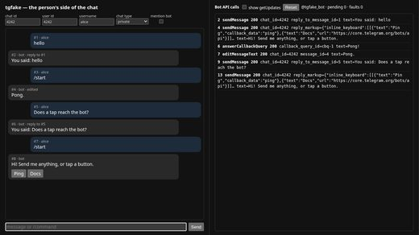

# Awesome AI Telegram Bots

[中文](README.zh-CN.md)

Open-source **Telegram bots built on AI**: GPT, Claude and local-model assistants, remote control for Claude Code and Codex, bot frameworks and MCP servers, utility, learning and business bots. 252 repos, each one read and security-graded by [Agent Skills Hub](https://agentskillshub.top?utm_source=github&utm_medium=awesome-list).

Live page with filters: **[https://agentskillshub.top/best/telegram-bot/](https://agentskillshub.top/best/telegram-bot/?utm_source=github&utm_medium=awesome-list)** · refreshed every 8 hours

## What these bots look like

<table>
<tr>
<td align="center" valign="top" width="33%"><b>💬 AI assistants</b> 92 repos  AI chat assistants in Telegram: GPT, Claude, Gemini, local models. <a href="#type-assistant"><b>View the list →</b></a></td>
<td align="center" valign="top" width="33%"><b>🛰 Agent remote control</b> 65 repos   Control Claude Code, Codex or a computer from your phone. <a href="#type-remote"><b>View the list →</b></a></td>
<td align="center" valign="top" width="33%"><b>🧱 Frameworks & MCP</b> 31 repos   Libraries, templates and MCP servers for building bots. <a href="#type-framework"><b>View the list →</b></a></td>
</tr>
<tr>
<td align="center" valign="top" width="33%"><b>🧰 Utility bots</b> 31 repos  Downloads, files, translation, group management. <a href="#type-utility"><b>View the list →</b></a></td>
<td align="center" valign="top" width="33%"><b>🎲 Fun & learning</b> 6 repos  Games, quizzes, language practice and companions. <a href="#type-fun"><b>View the list →</b></a></td>
<td align="center" valign="top" width="33%"><b>💼 Business</b> 27 repos  Support, sales, payments, trading and monitoring. <a href="#type-business"><b>View the list →</b></a></td>
</tr>
</table>

## Contents

- [💬 AI assistants](#type-assistant) (92)
- [🛰 Agent remote control](#type-remote) (65)
- [🧱 Frameworks & MCP](#type-framework) (31)
- [🧰 Utility bots](#type-utility) (31)
- [🎲 Fun & learning](#type-fun) (6)
- [💼 Business](#type-business) (27)

## How a repo gets on the list

1. It is a Telegram bot, or a tool for building or running one; Telegram is its main interface.
2. It is software someone can install or run, not a list of links or a placeholder.
3. It has a README. Without one it cannot be graded.
4. At 50 stars or more it is listed on topic alone. Under 50 it must also clear a README quality bar (shows it working, one-command start, a concrete outcome, complete docs), and have 5 stars.

The questions are answered by a decision model reading each README, not by hand. A repo near a cut-off can land on either side; open an issue if one is misfiled.

## 💬 AI assistants

[Open this type on the live page, sorted by stars →](https://agentskillshub.top/best/telegram-bot/?utm_source=github&utm_medium=awesome-list#type-assistant)

| Repo | Stars | What it does | Security |
|---|---:|---|---|
| [father-bot/chatgpt_telegram_bot](https://github.com/father-bot/chatgpt_telegram_bot) | 5.5k | 💬 Telegram bot with ChatGPT & Claude Python-based, using OpenAI's API. | [SAFE](https://agentskillshub.top/skill/father-bot/chatgpt_telegram_bot/?utm_source=github&utm_medium=awesome-list) |
| [tbxark/ChatGPT-Telegram-Workers](https://github.com/tbxark/ChatGPT-Telegram-Workers) | 3.8k | Easily deploy your Telegram ChatGPT bot on Cloudflare Workers (or Vercel, Docker...). | [SAFE](https://agentskillshub.top/skill/tbxark/ChatGPT-Telegram-Workers/?utm_source=github&utm_medium=awesome-list) |
| [altryne/chatGPT-telegram-bot](https://github.com/altryne/chatGPT-telegram-bot) | 1.6k | This is a very early attempt at having chatGPT work within a telegram bot | [SAFE](https://agentskillshub.top/skill/altryne/chatGPT-telegram-bot/?utm_source=github&utm_medium=awesome-list) |
| [yym68686/ChatGPT-Telegram-Bot](https://github.com/yym68686/ChatGPT-Telegram-Bot) | 1.3k | TeleChat: 🤖️ an AI chat Telegram bot can Web Search Powered by GPT-5, DALL·E , Groq, Gemini 2.5 Pro/Flash and the official Claude4.1 API using Python… | [SAFE](https://agentskillshub.top/skill/yym68686/ChatGPT-Telegram-Bot/?utm_source=github&utm_medium=awesome-list) |
| [V-know/ChatGPT-Telegram-Bot](https://github.com/V-know/ChatGPT-Telegram-Bot) | 649 | A Telegram bot with a silky smooth AI experience. UI enabled. | [SAFE](https://agentskillshub.top/skill/V-know/ChatGPT-Telegram-Bot/?utm_source=github&utm_medium=awesome-list) |
| [linuz90/claude-telegram-bot](https://github.com/linuz90/claude-telegram-bot) | 448 |  | [SAFE](https://agentskillshub.top/skill/linuz90/claude-telegram-bot/?utm_source=github&utm_medium=awesome-list) |
| [polakowo/gpt2bot](https://github.com/polakowo/gpt2bot) | 442 | Your new Telegram buddy powered by transformers | [SAFE](https://agentskillshub.top/skill/polakowo/gpt2bot/?utm_source=github&utm_medium=awesome-list) |
| [smixs/agent-second-brain](https://github.com/smixs/agent-second-brain) | 392 | An always-on second brain you talk to. Voice notes in Telegram → typed, linked knowledge in your Obsidian vault. Runs 24/7 on the Claude subscription… | [SAFE](https://agentskillshub.top/skill/smixs/agent-second-brain/?utm_source=github&utm_medium=awesome-list) |
| [Johnsheng1/cf-ai-TGbot](https://github.com/Johnsheng1/cf-ai-TGbot) | 384 | CF-ai-TGbot is a customizable Telegram bot powered by Node.js, integrating Cloudflare AI Gateway for smart, context-aware conversations. 🌐🤖 | [SAFE](https://agentskillshub.top/skill/Johnsheng1/cf-ai-TGbot/?utm_source=github&utm_medium=awesome-list) |
| [F33RNI/GPT-Telegramus](https://github.com/F33RNI/GPT-Telegramus) | 354 | 💜 The best free Telegram bot for ChatGPT, Microsoft Copilot (aka Bing AI / Sidney / EdgeGPT), Microsoft Copilot Designer (aka BingImageCreator), Gemi… | [CAUTION](https://agentskillshub.top/skill/F33RNI/GPT-Telegramus/?utm_source=github&utm_medium=awesome-list) |
| [nalgeon/pokitoki](https://github.com/nalgeon/pokitoki) | 342 | Humble AI Telegram Bot | [SAFE](https://agentskillshub.top/skill/nalgeon/pokitoki/?utm_source=github&utm_medium=awesome-list) |
| [pyfbsdk59/Flask-ChatGPT-TelegramBot-Vercel](https://github.com/pyfbsdk59/Flask-ChatGPT-TelegramBot-Vercel) | 304 | 一個Flask ChatGPT TelegramBot快速建置於平台Vercel。 | [SAFE](https://agentskillshub.top/skill/pyfbsdk59/Flask-ChatGPT-TelegramBot-Vercel/?utm_source=github&utm_medium=awesome-list) |
| [yesbhautik/Master-AI-BOT](https://github.com/yesbhautik/Master-AI-BOT) | 268 | Master AI BOT 🤖: Unleash the power of GPT-4 Turbo with our fast and limitless Telegram bot. Say goodbye to daily usage limits and laggy interfaces. E… | [SAFE](https://agentskillshub.top/skill/yesbhautik/Master-AI-BOT/?utm_source=github&utm_medium=awesome-list) |
| [14790897/tg-voice-ai](https://github.com/14790897/tg-voice-ai) | 254 | telegram voice chat ai bot with image generate | [SAFE](https://agentskillshub.top/skill/14790897/tg-voice-ai/?utm_source=github&utm_medium=awesome-list) |
| [Helixform/TeleGPT](https://github.com/Helixform/TeleGPT) | 237 | An out-of-box ChatGPT bot for Telegram. | [SAFE](https://agentskillshub.top/skill/Helixform/TeleGPT/?utm_source=github&utm_medium=awesome-list) |
| [tpai/summary-gpt-bot](https://github.com/tpai/summary-gpt-bot) | 234 | An AI-powered text summarization Telegram bot that generates concise summaries of text, URLs, PDFs, and YouTube videos. | [SAFE](https://agentskillshub.top/skill/tpai/summary-gpt-bot/?utm_source=github&utm_medium=awesome-list) |
| [smixs/iva-agent](https://github.com/smixs/iva-agent) | 233 | AI assistant in Telegram that remembers everything and helps you run your life. Self-hosted in one command. | [SAFE](https://agentskillshub.top/skill/smixs/iva-agent/?utm_source=github&utm_medium=awesome-list) |
| [ciuzaak/Claude-Telegram-Bot](https://github.com/ciuzaak/Claude-Telegram-Bot) | 205 | Anthropic Claude & Google Bard Bot for Telegram. | [SAFE](https://agentskillshub.top/skill/ciuzaak/Claude-Telegram-Bot/?utm_source=github&utm_medium=awesome-list) |
| [asukaminato0721/telegram-summary-bot](https://github.com/asukaminato0721/telegram-summary-bot) | 202 | Summarize group chat with AI, LLM && query group chat, FREE to deploy your own, support img, link meta info, reply to, auto fold result, 支持中文检索. | [SAFE](https://agentskillshub.top/skill/asukaminato0721/telegram-summary-bot/?utm_source=github&utm_medium=awesome-list) |
| [sudo-eugene/Connect-Telegram-Bot-to-Google-Sheets-ChatGPT-OpenAI](https://github.com/sudo-eugene/Connect-Telegram-Bot-to-Google-Sheets-ChatGPT-OpenAI) | 190 | Connect Telegram Bot to Google Sheets via Google Apps Scripts | [SAFE](https://agentskillshub.top/skill/sudo-eugene/Connect-Telegram-Bot-to-Google-Sheets-ChatGPT-OpenAI/?utm_source=github&utm_medium=awesome-list) |
| [flynnoct/chatgpt-telegram-bot](https://github.com/flynnoct/chatgpt-telegram-bot) | 170 | Telegram bot implemented by OFFICIAL OpenAI ChatGPT API (gpt-3.5-turbo, released on 2023-03-01) | [SAFE](https://agentskillshub.top/skill/flynnoct/chatgpt-telegram-bot/?utm_source=github&utm_medium=awesome-list) |
| [HexyeDEV/Telegram-Chatbot-Gpt4Free](https://github.com/HexyeDEV/Telegram-Chatbot-Gpt4Free) | 168 | This is a Python-based Telegram bot using the telethon library. The bot responds to messages using the evagpt4 reverse engeneered api from GPT4FREE r… | [SAFE](https://agentskillshub.top/skill/HexyeDEV/Telegram-Chatbot-Gpt4Free/?utm_source=github&utm_medium=awesome-list) |
| [Timmy-web/Poe-Telegram-Chatbot](https://github.com/Timmy-web/Poe-Telegram-Chatbot) | 168 | 调用Poe官方API实现Telegram对话机器人，主要调用GPT-4和Claude-3-Opus模型。 | [SAFE](https://agentskillshub.top/skill/Timmy-web/Poe-Telegram-Chatbot/?utm_source=github&utm_medium=awesome-list) |
| [kargarisaac/telegram_link_summarizer_agent](https://github.com/kargarisaac/telegram_link_summarizer_agent) | 156 | Agentic Telegram bot that summarizes links (articles, papers, tweets, LinkedIn posts, PDFs) shared in a channel. Instantly provides concise summaries… | [CAUTION](https://agentskillshub.top/skill/kargarisaac/telegram_link_summarizer_agent/?utm_source=github&utm_medium=awesome-list) |
| [innightwolfsleep/llm_telegram_bot](https://github.com/innightwolfsleep/llm_telegram_bot) | 135 | LLM telegram bot | [SAFE](https://agentskillshub.top/skill/innightwolfsleep/llm_telegram_bot/?utm_source=github&utm_medium=awesome-list) |
| [Kourva/AwesomeChatGPTBot](https://github.com/Kourva/AwesomeChatGPTBot) | 121 | ChatGPT Telegram bot: Free & Rich-Feature bot for enhanced conversations. | [SAFE](https://agentskillshub.top/skill/Kourva/AwesomeChatGPTBot/?utm_source=github&utm_medium=awesome-list) |
| [ma2za/telegram-llm-bot](https://github.com/ma2za/telegram-llm-bot) | 112 | Local-first Telegram AI bot with Ollama tool calling, voice transcription, MinIO storage, SearchApi web search, and readiness checks | [SAFE](https://agentskillshub.top/skill/ma2za/telegram-llm-bot/?utm_source=github&utm_medium=awesome-list) |
| [Leask/halbot](https://github.com/Leask/halbot) | 103 | Just another AI powered Telegram bot, which is simple design, easy to use, extendable and fun. | [SAFE](https://agentskillshub.top/skill/Leask/halbot/?utm_source=github&utm_medium=awesome-list) |
| [Hamster-Prime/Smart_Group_Bot](https://github.com/Hamster-Prime/Smart_Group_Bot) | 98 | 基于 LLM 的 Telegram 群聊智能管理机器人 — 智能决策、知识库 RAG、内容审查、贴纸学习、联网搜索、多层记忆架构 | [SAFE](https://agentskillshub.top/skill/Hamster-Prime/Smart_Group_Bot/?utm_source=github&utm_medium=awesome-list) |
| [htlin222/mini-claw](https://github.com/htlin222/mini-claw) | 93 | Telegram bot for persistent Claude/ChatGPT conversations using Pi agent — zero-cost multi-turn AI sessions with file attachments, shell access, and l… | [SAFE](https://agentskillshub.top/skill/htlin222/mini-claw/?utm_source=github&utm_medium=awesome-list) |
| [Lifailon/openrouter-bot](https://github.com/Lifailon/openrouter-bot) | 88 | This project allows to launch your Telegram bot in a few minutes to communicate with free or paid AI models via OpenRouter. | [SAFE](https://agentskillshub.top/skill/Lifailon/openrouter-bot/?utm_source=github&utm_medium=awesome-list) |
| [LexiestLeszek/scrapeGPT](https://github.com/LexiestLeszek/scrapeGPT) | 86 | ScrapeGPT is a RAG-based Telegram bot designed to scrape and analyze websites, then answer questions based on the scraped content. The bot utilizes R… | [SAFE](https://agentskillshub.top/skill/LexiestLeszek/scrapeGPT/?utm_source=github&utm_medium=awesome-list) |
| [wxc971231/TelegramChatBot](https://github.com/wxc971231/TelegramChatBot) | 85 | A telegram chatbot powered by OpenAI GPT API | [SAFE](https://agentskillshub.top/skill/wxc971231/TelegramChatBot/?utm_source=github&utm_medium=awesome-list) |
| [ChiSonKon/telegram-business-ai-bot](https://github.com/ChiSonKon/telegram-business-ai-bot) | 81 | 【聊天自动化】一个24小时在线的 Telegram 智能双向私聊机器人 🤖 /[Chat Automation] A 24/7 online smart Telegram bot for two-way private messaging 🤖 | [SAFE](https://agentskillshub.top/skill/ChiSonKon/telegram-business-ai-bot/?utm_source=github&utm_medium=awesome-list) |
| [Rai220/TelegramChatGPT](https://github.com/Rai220/TelegramChatGPT) | 81 | Personal telegram chat-bot based on OpenAI GPT-3 finetuning. | [SAFE](https://agentskillshub.top/skill/Rai220/TelegramChatGPT/?utm_source=github&utm_medium=awesome-list) |
| [noes14155/Telegrambot-with-GPT](https://github.com/noes14155/Telegrambot-with-GPT) | 80 | telegram bot with gpt | [SAFE](https://agentskillshub.top/skill/noes14155/Telegrambot-with-GPT/?utm_source=github&utm_medium=awesome-list) |
| [Magerko/TelegramHelper](https://github.com/Magerko/TelegramHelper) | 74 | Персональный AI-ассистент для Telegram: userbot + control bot с агентом, понимающим голос и свободный текст. SQLite FTS5, Qdrant, Whisper, OpenAI/Gem… | [SAFE](https://agentskillshub.top/skill/Magerko/TelegramHelper/?utm_source=github&utm_medium=awesome-list) |
| [dudynets/Telegram-Summarize-Bot](https://github.com/dudynets/Telegram-Summarize-Bot) | 74 | A Telegram bot that summarizes messages from a chat using AI. | [SAFE](https://agentskillshub.top/skill/dudynets/Telegram-Summarize-Bot/?utm_source=github&utm_medium=awesome-list) |
| [tusharhero/aitelegrambot](https://github.com/tusharhero/aitelegrambot) | 74 | aitelegrambot is a telegram bot which uses Ollama as its backend. | [SAFE](https://agentskillshub.top/skill/tusharhero/aitelegrambot/?utm_source=github&utm_medium=awesome-list) |
| [sazonovanton/SirChatalot](https://github.com/sazonovanton/SirChatalot) | 72 | A Telegram bot that proves you don't need a body to have a personality. Works with any OpenAI-compatible LLM; agentic tools, MCP, RAG over your files… | [SAFE](https://agentskillshub.top/skill/sazonovanton/SirChatalot/?utm_source=github&utm_medium=awesome-list) |
| [flows-network/telegram-llm](https://github.com/flows-network/telegram-llm) | 71 | A Telegram LLM bot written in Rust | [SAFE](https://agentskillshub.top/skill/flows-network/telegram-llm/?utm_source=github&utm_medium=awesome-list) |
| [harshitethic/ChatGPT-Telegram-Bot](https://github.com/harshitethic/ChatGPT-Telegram-Bot) | 71 |  | [SAFE](https://agentskillshub.top/skill/harshitethic/ChatGPT-Telegram-Bot/?utm_source=github&utm_medium=awesome-list) |
| [xluxeq/GPT2-Telegram-Chatbot](https://github.com/xluxeq/GPT2-Telegram-Chatbot) | 69 | GPT-2 Telegram Chat bot | [CAUTION](https://agentskillshub.top/skill/xluxeq/GPT2-Telegram-Chatbot/?utm_source=github&utm_medium=awesome-list) |
| [jf3tt/chatgpt-telegram-bot](https://github.com/jf3tt/chatgpt-telegram-bot) | 62 | Python telegram bot, which utilizes the OpenAI API for implementing GPT-4 and speech-to-text functionality. The bot handles text and voice input from… | [SAFE](https://agentskillshub.top/skill/jf3tt/chatgpt-telegram-bot/?utm_source=github&utm_medium=awesome-list) |
| [thaolst/tara-bot](https://github.com/thaolst/tara-bot) | 62 | Tara Bot — AI Telegram agent: search flights, compare prices, inject affiliate links | [SAFE](https://agentskillshub.top/skill/thaolst/tara-bot/?utm_source=github&utm_medium=awesome-list) |
| [vladislav-bordiug/ChatGPT_DALL_E_StableDiffusion_Telegram_Bot](https://github.com/vladislav-bordiug/ChatGPT_DALL_E_StableDiffusion_Telegram_Bot) | 56 | This is ChatGPT, DALL·E, Stable Diffusion python-telegram-bot with cryptocurrency payments. It allows you to generate images and chat with ChatGPT. | [CAUTION](https://agentskillshub.top/skill/vladislav-bordiug/ChatGPT_DALL_E_StableDiffusion_Telegram_Bot/?utm_source=github&utm_medium=awesome-list) |
| [KonstantinVanov/Article-Assistant--RAG-Telegram-Bot](https://github.com/KonstantinVanov/Article-Assistant--RAG-Telegram-Bot) | 55 | A sophisticated RAG (Retrieval-Augmented Generation) Telegram bot that transforms articles and documents into interactive knowledge bases. Upload PDF… | [SAFE](https://agentskillshub.top/skill/KonstantinVanov/Article-Assistant--RAG-Telegram-Bot/?utm_source=github&utm_medium=awesome-list) |
| [s-nagaev/chibi](https://github.com/s-nagaev/chibi) | 55 | Your Digital Companion. Self-hosted Telegram bot orchestrating multiple AI providers (OpenAI, Anthropic, Google, xAI, DeepSeek, Mistral, Alibaba, Min… | [SAFE](https://agentskillshub.top/skill/s-nagaev/chibi/?utm_source=github&utm_medium=awesome-list) |
| [Mostafa-Abbasi/HyperTAG](https://github.com/Mostafa-Abbasi/HyperTAG) | 53 | HyperTAG Bot - AI-Generated Tags and Summaries for Telegram Messages | [SAFE](https://agentskillshub.top/skill/Mostafa-Abbasi/HyperTAG/?utm_source=github&utm_medium=awesome-list) |
| [emingenc/telegramGPT](https://github.com/emingenc/telegramGPT) | 53 | step-by-step guide on creating your very own AI bot using Python, Telegram, and OpenAI GPT models. | [SAFE](https://agentskillshub.top/skill/emingenc/telegramGPT/?utm_source=github&utm_medium=awesome-list) |
| [AlexTs10/ai-girlfriend-with-voice-telegram-bot](https://github.com/AlexTs10/ai-girlfriend-with-voice-telegram-bot) | 51 | GPT Telegram Bot | [SAFE](https://agentskillshub.top/skill/AlexTs10/ai-girlfriend-with-voice-telegram-bot/?utm_source=github&utm_medium=awesome-list) |
| [ahkarimi/chapar](https://github.com/ahkarimi/chapar) | 43 | Self-hosted Telegram bot for AI-driven chart analysis and market intelligence. FastAPI + Celery + Redis + PostgreSQL. | [SAFE](https://agentskillshub.top/skill/ahkarimi/chapar/?utm_source=github&utm_medium=awesome-list) |
| [AbuZar-Ansarii/Openclaw-phone-control](https://github.com/AbuZar-Ansarii/Openclaw-phone-control) | 37 | OpenClaw allows you to manage your phone via a Telegram bot using the power of local AI (Ollama). No root access is required, making it accessible fo… | [SAFE](https://agentskillshub.top/skill/AbuZar-Ansarii/Openclaw-phone-control/?utm_source=github&utm_medium=awesome-list) |
| [zhuchangyi/Gemini2tg](https://github.com/zhuchangyi/Gemini2tg) | 31 | Gemini2tg is a project which deploys Google Gemini's API to a Telegram bot, giving you your own AI bot powerd by Gemini | [CAUTION](https://agentskillshub.top/skill/zhuchangyi/Gemini2tg/?utm_source=github&utm_medium=awesome-list) |
| [xingty/CatGPT](https://github.com/xingty/CatGPT) | 30 | A telegram bot for OpenAI API | [SAFE](https://agentskillshub.top/skill/xingty/CatGPT/?utm_source=github&utm_medium=awesome-list) |
| [aneeshjoy/llama-telegram-bot](https://github.com/aneeshjoy/llama-telegram-bot) | 28 | A simple telegram chat bot for LLMs supported by llama.cpp | [CAUTION](https://agentskillshub.top/skill/aneeshjoy/llama-telegram-bot/?utm_source=github&utm_medium=awesome-list) |
| [maddness/vkusvill-mcp-bot](https://github.com/maddness/vkusvill-mcp-bot) | 28 | Telegram-бот для сбора продуктовой корзины ВкусВилл через mcp | [CAUTION](https://agentskillshub.top/skill/maddness/vkusvill-mcp-bot/?utm_source=github&utm_medium=awesome-list) |
| [shanzi/Telegram-ChatGPT](https://github.com/shanzi/Telegram-ChatGPT) | 28 | A customizable Telegram bot with a ChatGPT (or GPT4, bring your own API key) backend. You can configure the bot’s context and prompt in template sett… | [SAFE](https://agentskillshub.top/skill/shanzi/Telegram-ChatGPT/?utm_source=github&utm_medium=awesome-list) |
| [AbhiTheModder/gemini-ai-telegram](https://github.com/AbhiTheModder/gemini-ai-telegram) | 26 | Pyrogram(Pyrofork) Based Python script for Telegram Userbots and Bots | [SAFE](https://agentskillshub.top/skill/AbhiTheModder/gemini-ai-telegram/?utm_source=github&utm_medium=awesome-list) |
| [LuKresXD/claw-skeleton](https://github.com/LuKresXD/claw-skeleton) | 26 | 🪼 A personal AI assistant that lives in Telegram — every topic is its own isolated Claude Code agent with layered persistent memory and proactive cro… | [CAUTION](https://agentskillshub.top/skill/LuKresXD/claw-skeleton/?utm_source=github&utm_medium=awesome-list) |
| [anxkhn/OpynGPT-Chat](https://github.com/anxkhn/OpynGPT-Chat) | 23 | A Telegram chat bot powered by OpynGPT for natural language responses without the need for API keys. Easy to set up and use. | [SAFE](https://agentskillshub.top/skill/anxkhn/OpynGPT-Chat/?utm_source=github&utm_medium=awesome-list) |
| [JackBekket/Hellper](https://github.com/JackBekket/Hellper) | 21 | Telegram bot which can work with both openAI and LocalAI modes, it also uses UncensoredGPT models like Wizard-Uncensored. It can be launch at ordinar… | [SAFE](https://agentskillshub.top/skill/JackBekket/Hellper/?utm_source=github&utm_medium=awesome-list) |
| [muthupriyan-dev/telegram-ai-bot](https://github.com/muthupriyan-dev/telegram-ai-bot) | 21 |  | [SAFE](https://agentskillshub.top/skill/muthupriyan-dev/telegram-ai-bot/?utm_source=github&utm_medium=awesome-list) |
| [EzeSandes/ChatGPT-OpenAI-TelegramBot](https://github.com/EzeSandes/ChatGPT-OpenAI-TelegramBot) | 15 | Unofficial OpenAI Telegram bot to interact with chatGPT | [SAFE](https://agentskillshub.top/skill/EzeSandes/ChatGPT-OpenAI-TelegramBot/?utm_source=github&utm_medium=awesome-list) |
| [Tobiaspk/gpt3_telebot](https://github.com/Tobiaspk/gpt3_telebot) | 15 | Telegram Bot using GPT3 and enhanced functions | [SAFE](https://agentskillshub.top/skill/Tobiaspk/gpt3_telebot/?utm_source=github&utm_medium=awesome-list) |
| [pyfbsdk59/Flask-ChatGPT-TelegramBot-Render](https://github.com/pyfbsdk59/Flask-ChatGPT-TelegramBot-Render) | 15 | 一個Flask ChatGPT TelegramBot快速建置於平台Render。 | [SAFE](https://agentskillshub.top/skill/pyfbsdk59/Flask-ChatGPT-TelegramBot-Render/?utm_source=github&utm_medium=awesome-list) |
| [andykras/gptbot](https://github.com/andykras/gptbot) | 14 | Telegram bot with Assistant AsyncOpenAI API client and aiogram lib | [CAUTION](https://agentskillshub.top/skill/andykras/gptbot/?utm_source=github&utm_medium=awesome-list) |
| [Exdenta/OinkAIJobSearch](https://github.com/Exdenta/OinkAIJobSearch) | 10 | AI job-search agent in Telegram — scrapes 25+ job boards, scores every posting against your CV with Claude, pushes real matches to your chat. Self-ho… | [CAUTION](https://agentskillshub.top/skill/Exdenta/OinkAIJobSearch/?utm_source=github&utm_medium=awesome-list) |
| [alifgardika/CatatAja](https://github.com/alifgardika/CatatAja) | 9 | Bot Telegram pencatat pengeluaran tanpa server. Ketik transaksi pakai bahasa sehari-hari, bot memahaminya dengan Gemini AI lalu menyimpannya ke Googl… | [SAFE](https://agentskillshub.top/skill/alifgardika/CatatAja/?utm_source=github&utm_medium=awesome-list) |
| [deseven/telegram-actual-llm-helper](https://github.com/deseven/telegram-actual-llm-helper) | 9 | A bot to assist with logging transactions in Actual Budget, leveraging the capabilities of ChatGPT or other LLMs | [SAFE](https://agentskillshub.top/skill/deseven/telegram-actual-llm-helper/?utm_source=github&utm_medium=awesome-list) |
| [dhir4j/chatgpt-bot-telegram](https://github.com/dhir4j/chatgpt-bot-telegram) | 9 | A Python script that implements a basic chatbot using the OpenAI GPT-3 API. | [SAFE](https://agentskillshub.top/skill/dhir4j/chatgpt-bot-telegram/?utm_source=github&utm_medium=awesome-list) |
| [evgenyigumnov/ai-agent-telegram-bot](https://github.com/evgenyigumnov/ai-agent-telegram-bot) | 8 | A smart and friendly AI-powered Telegram bot that can answer questions, store and forget information, and even execute terminal commands on request.… | [SAFE](https://agentskillshub.top/skill/evgenyigumnov/ai-agent-telegram-bot/?utm_source=github&utm_medium=awesome-list) |
| [backmeupplz/telegram-ai-searcher](https://github.com/backmeupplz/telegram-ai-searcher) | 7 | Telegram bot that searches the web and streams AI answers live. Live demo: https://t.me/frdy_bot — built with grammY, Fireworks AI, and self-hosted S… | [SAFE](https://agentskillshub.top/skill/backmeupplz/telegram-ai-searcher/?utm_source=github&utm_medium=awesome-list) |
| [hschickdevs/Telegram-AI-Software-Architect](https://github.com/hschickdevs/Telegram-AI-Software-Architect) | 7 | Telegram bot that uses AI to generate full codebases from user prompts, providing structured, ready-to-deploy software projects, differentiating from… | [SAFE](https://agentskillshub.top/skill/hschickdevs/Telegram-AI-Software-Architect/?utm_source=github&utm_medium=awesome-list) |
| [irfan-yulianto/Telegram-Finance-Bot](https://github.com/irfan-yulianto/Telegram-Finance-Bot) | 7 | AI-powered personal finance tracker bot for Telegram. Track income & expenses with receipt scanning, natural language input, and automatic Google She… | [CAUTION](https://agentskillshub.top/skill/irfan-yulianto/Telegram-Finance-Bot/?utm_source=github&utm_medium=awesome-list) |
| [DoctorSB/GPT_Telegram_Bot](https://github.com/DoctorSB/GPT_Telegram_Bot) | 6 | Код для работы с api openai | [SAFE](https://agentskillshub.top/skill/DoctorSB/GPT_Telegram_Bot/?utm_source=github&utm_medium=awesome-list) |
| [c17hawke/chatGPT-Telegram-bot](https://github.com/c17hawke/chatGPT-Telegram-bot) | 6 | chatGPT-Telegram-bot | [SAFE](https://agentskillshub.top/skill/c17hawke/chatGPT-Telegram-bot/?utm_source=github&utm_medium=awesome-list) |
| [ibidathoillah/gemini-cli-telegram](https://github.com/ibidathoillah/gemini-cli-telegram) | 6 | Run Google Gemini CLI as a Telegram bot. AI coding assistant with project management, scheduled tasks, and autopilot mode. | [CAUTION](https://agentskillshub.top/skill/ibidathoillah/gemini-cli-telegram/?utm_source=github&utm_medium=awesome-list) |
| [nickathens/MyOldMachine](https://github.com/nickathens/MyOldMachine) | 6 | Self-hosted LLM-powered Telegram bot with modular skill system. Provider-agnostic: Claude, OpenAI, Gemini, Ollama, OpenRouter. | [CAUTION](https://agentskillshub.top/skill/nickathens/MyOldMachine/?utm_source=github&utm_medium=awesome-list) |
| [rokoss21/OpenBot-2.0](https://github.com/rokoss21/OpenBot-2.0) | 6 | This Telegram bot interfaces with AI models via OpenRouter, enabling users to authenticate with an API key, select AI models for interaction, process… | [CAUTION](https://agentskillshub.top/skill/rokoss21/OpenBot-2.0/?utm_source=github&utm_medium=awesome-list) |
| [Aman262626/DarkGPT-Telegram-Bot](https://github.com/Aman262626/DarkGPT-Telegram-Bot) | 5 | 🌑 DarkGPT - A powerful Telegram bot powered by Claude Opus AI with conversation memory and multi-language support | [SAFE](https://agentskillshub.top/skill/Aman262626/DarkGPT-Telegram-Bot/?utm_source=github&utm_medium=awesome-list) |
| [Cloudveerge/Gemini-1.5-flash-AI-Telegram-Bot](https://github.com/Cloudveerge/Gemini-1.5-flash-AI-Telegram-Bot) | 5 | An intelligent, conversational Telegram bot built on Node.js, leveraging the gemini-1.5-flash generative AI model. | [SAFE](https://agentskillshub.top/skill/Cloudveerge/Gemini-1.5-flash-AI-Telegram-Bot/?utm_source=github&utm_medium=awesome-list) |
| [YevgeniyKapustin/VanessaAI](https://github.com/YevgeniyKapustin/VanessaAI) | 5 | Telegram AI Bot | [SAFE](https://agentskillshub.top/skill/YevgeniyKapustin/VanessaAI/?utm_source=github&utm_medium=awesome-list) |
| [aleksbuss/termux-voice-bot](https://github.com/aleksbuss/termux-voice-bot) | 5 | A pocket-sized AI server running on your Android smartphone. This project turns your phone into a fully autonomous Telegram bot for voice and text pr… | [SAFE](https://agentskillshub.top/skill/aleksbuss/termux-voice-bot/?utm_source=github&utm_medium=awesome-list) |
| [binnwkwk/SylvieAi-Telegram-Bot](https://github.com/binnwkwk/SylvieAi-Telegram-Bot) | 5 | This is the source code of the Sylvie AI telegram bot | [SAFE](https://agentskillshub.top/skill/binnwkwk/SylvieAi-Telegram-Bot/?utm_source=github&utm_medium=awesome-list) |
| [bisbeebucky/ai-bot](https://github.com/bisbeebucky/ai-bot) | 5 | AI Telegram personal finance bot with cashflow forecasting and overdraft prediction | [SAFE](https://agentskillshub.top/skill/bisbeebucky/ai-bot/?utm_source=github&utm_medium=awesome-list) |
| [divanshusingh-ds/TELREGRAM-BOT](https://github.com/divanshusingh-ds/TELREGRAM-BOT) | 5 | AI-powered Telegram assistant built with Python, Google Gemini, LangChain & LangGraph, featuring agentic tool calling, conversation memory, and modul… | [SAFE](https://agentskillshub.top/skill/divanshusingh-ds/TELREGRAM-BOT/?utm_source=github&utm_medium=awesome-list) |
| [djblack1209-coder/OpenClaw-Bot](https://github.com/djblack1209-coder/OpenClaw-Bot) | 5 | OpenEverything — Personal AI automation with Telegram, a Tauri console, and traceable model budgets. Python/FastAPI + React/Rust. | [SAFE](https://agentskillshub.top/skill/djblack1209-coder/OpenClaw-Bot/?utm_source=github&utm_medium=awesome-list) |
| [flows-network/telegram-claude](https://github.com/flows-network/telegram-claude) | 5 |  | [SAFE](https://agentskillshub.top/skill/flows-network/telegram-claude/?utm_source=github&utm_medium=awesome-list) |
| [palaklohade/pdf_Sumarizer_telegram_bot](https://github.com/palaklohade/pdf_Sumarizer_telegram_bot) | 5 | A Telegram bot built with Python that summarizes PDF files using an LLM model. Users can send PDFs to the bot and receive concise summaries or answer… | [SAFE](https://agentskillshub.top/skill/palaklohade/pdf_Sumarizer_telegram_bot/?utm_source=github&utm_medium=awesome-list) |
| [tanishra/Telegram-Smart-Agent-Bot](https://github.com/tanishra/Telegram-Smart-Agent-Bot) | 5 | SmartAgent Bot is an AI-powered Telegram bot built using n8n workflows and Google Gemini models. It processes both text and voice messages, intellige… | [SAFE](https://agentskillshub.top/skill/tanishra/Telegram-Smart-Agent-Bot/?utm_source=github&utm_medium=awesome-list) |
| [zkrige/zoidberg](https://github.com/zkrige/zoidberg) | 5 | Your own Claude on your own hardware, running on your Claude subscription instead of metered API credit. Talk to it on Telegram; it runs your schedul… | [SAFE](https://agentskillshub.top/skill/zkrige/zoidberg/?utm_source=github&utm_medium=awesome-list) |

## 🛰 Agent remote control

[Open this type on the live page, sorted by stars →](https://agentskillshub.top/best/telegram-bot/?utm_source=github&utm_medium=awesome-list#type-remote)

| Repo | Stars | What it does | Security |
|---|---:|---|---|
| [overwirehq/claude-code-telegram](https://github.com/overwirehq/claude-code-telegram) | 2.8k | A powerful Telegram bot that provides remote access to Claude Code, enabling developers to interact with their projects from anywhere with full AI as… | [SAFE](https://agentskillshub.top/skill/overwirehq/claude-code-telegram/?utm_source=github&utm_medium=awesome-list) |
| [grinev/opencode-telegram-bot](https://github.com/grinev/opencode-telegram-bot) | 1.2k | OpenCode mobile client via Telegram: run and monitor AI coding tasks from your phone while everything runs locally on your machine. OpenCode V2 suppo… | [SAFE](https://agentskillshub.top/skill/grinev/opencode-telegram-bot/?utm_source=github&utm_medium=awesome-list) |
| [banteg/takopi](https://github.com/banteg/takopi) | 1.1k | he just wants to help-pi! | [SAFE](https://agentskillshub.top/skill/banteg/takopi/?utm_source=github&utm_medium=awesome-list) |
| [hanxiao/claudecode-telegram](https://github.com/hanxiao/claudecode-telegram) | 609 | Telegram bridge for Claude Code | [SAFE](https://agentskillshub.top/skill/hanxiao/claudecode-telegram/?utm_source=github&utm_medium=awesome-list) |
| [duckbugio/flock](https://github.com/duckbugio/flock) | 502 | Autonomous AI dev-team bot | [SAFE](https://agentskillshub.top/skill/duckbugio/flock/?utm_source=github&utm_medium=awesome-list) |
| [PleasePrompto/ductor](https://github.com/PleasePrompto/ductor) | 458 | Control Claude Code, Codex CLI and Gemini CLI from Telegram. Live streaming, persistent memory, cron jobs, webhooks, Docker sandboxing. | [SAFE](https://agentskillshub.top/skill/PleasePrompto/ductor/?utm_source=github&utm_medium=awesome-list) |
| [godagoo/claude-telegram-relay](https://github.com/godagoo/claude-telegram-relay) | 326 | Minimal pattern for running Claude Code as an always-on Telegram bot. Cross-platform daemon setup included. | [SAFE](https://agentskillshub.top/skill/godagoo/claude-telegram-relay/?utm_source=github&utm_medium=awesome-list) |
| [alexei-led/ccgram](https://github.com/alexei-led/ccgram) | 277 | Telegram ↔ tmux/herdr/agterm bridge for Claude Code, Codex CLI, and Pi Agent. Monitor output, respond to prompts, manage parallel sessions. Control A… | [SAFE](https://agentskillshub.top/skill/alexei-led/ccgram/?utm_source=github&utm_medium=awesome-list) |
| [six-ddc/ccbot](https://github.com/six-ddc/ccbot) | 276 | Telegram ↔ tmux bridge for Claude Code: 1 topic = 1 window = 1 session | [SAFE](https://agentskillshub.top/skill/six-ddc/ccbot/?utm_source=github&utm_medium=awesome-list) |
| [earlyaidopters/claudeclaw](https://github.com/earlyaidopters/claudeclaw) | 173 | Claude Code CLI as a personal Telegram bot — voice, memory, scheduled tasks, all your skills from your pocket. | [SAFE](https://agentskillshub.top/skill/earlyaidopters/claudeclaw/?utm_source=github&utm_medium=awesome-list) |
| [emreturkmencom/antigravity-telegram-suite](https://github.com/emreturkmencom/antigravity-telegram-suite) | 172 | Antigravity Telegram bot — remote-control your AI agent via Telegram. Chat, switch models, orchestrate multi-agent workflows, and manage workspaces f… | [SAFE](https://agentskillshub.top/skill/emreturkmencom/antigravity-telegram-suite/?utm_source=github&utm_medium=awesome-list) |
| [NachoSEO/claudegram](https://github.com/NachoSEO/claudegram) | 153 | Telegram bot that bridges messages to Claude Code | [SAFE](https://agentskillshub.top/skill/NachoSEO/claudegram/?utm_source=github&utm_medium=awesome-list) |
| [terranc/claude-telegram-bot-bridge](https://github.com/terranc/claude-telegram-bot-bridge) | 134 | A lightweight Telegram bot that bridges Claude Code to any local folder, with autostart support for remote mobile development. | [CAUTION](https://agentskillshub.top/skill/terranc/claude-telegram-bot-bridge/?utm_source=github&utm_medium=awesome-list) |
| [k1p1l0/claude-telegram-supercharged](https://github.com/k1p1l0/claude-telegram-supercharged) | 132 | Run Claude Code 24/7 from Telegram. Drop-in upgrade for the official plugin: voice notes both ways, a self-healing daemon, memory across restarts, an… | [SAFE](https://agentskillshub.top/skill/k1p1l0/claude-telegram-supercharged/?utm_source=github&utm_medium=awesome-list) |
| [kaida-palooza/ccpoke](https://github.com/kaida-palooza/ccpoke) | 103 | Bridge between AI coding agents and your phone — notifications, 2-way chat, permissions | [SAFE](https://agentskillshub.top/skill/kaida-palooza/ccpoke/?utm_source=github&utm_medium=awesome-list) |
| [Ansh-Vortex/Vortex-Advance-RAT](https://github.com/Ansh-Vortex/Vortex-Advance-RAT) | 99 | Advance Open-Source RAT Builder Access via Telegram Bot with over 60+ commands | [SAFE](https://agentskillshub.top/skill/Ansh-Vortex/Vortex-Advance-RAT/?utm_source=github&utm_medium=awesome-list) |
| [gergomiklos/heyagent](https://github.com/gergomiklos/heyagent) | 94 | Telegram bridge for Claude Code and Codex CLI | [SAFE](https://agentskillshub.top/skill/gergomiklos/heyagent/?utm_source=github&utm_medium=awesome-list) |
| [seedprod/openclaw-prompts-and-skills](https://github.com/seedprod/openclaw-prompts-and-skills) | 93 | Telegram bot that talks to headless Claude Code - proof of concept | [UNSAFE](https://agentskillshub.top/skill/seedprod/openclaw-prompts-and-skills/?utm_source=github&utm_medium=awesome-list) |
| [alhinawi/telegram-notifier](https://github.com/alhinawi/telegram-notifier) | 92 | Universal Telegram Notifier Plugin & Skill for AI Agents (Antigravity, Claude Code, Codex, Cursor, Windsurf) + Remote Control Setup | [SAFE](https://agentskillshub.top/skill/alhinawi/telegram-notifier/?utm_source=github&utm_medium=awesome-list) |
| [b1rdmania/ghostclaw](https://github.com/b1rdmania/ghostclaw) | 92 | an AI that lives on your computer and does stuff for you. Public beta. | [SAFE](https://agentskillshub.top/skill/b1rdmania/ghostclaw/?utm_source=github&utm_medium=awesome-list) |
| [MaxMiksa/Tele-Bot](https://github.com/MaxMiksa/Tele-Bot) | 91 | A clean Bot running on your PC, interacting with you on Telegram via Claude or Codex. | [SAFE](https://agentskillshub.top/skill/MaxMiksa/Tele-Bot/?utm_source=github&utm_medium=awesome-list) |
| [areweai/tsgram-mcp](https://github.com/areweai/tsgram-mcp) | 88 | TSGram - Telegram MCP Server for local Claude Code integration - debug and vibe code on the go! | [CAUTION](https://agentskillshub.top/skill/areweai/tsgram-mcp/?utm_source=github&utm_medium=awesome-list) |
| [pavel-molyanov/telegram-ai-agent](https://github.com/pavel-molyanov/telegram-ai-agent) | 87 | Generic Claude/Codex Telegram bot runtime | [SAFE](https://agentskillshub.top/skill/pavel-molyanov/telegram-ai-agent/?utm_source=github&utm_medium=awesome-list) |
| [0xtbug/telbot](https://github.com/0xtbug/telbot) | 78 | Go-based tool for managing Telkomsel accounts via Telegram Bot, Terminal CLI, or MCP Server (for AI agents). | [CAUTION](https://agentskillshub.top/skill/0xtbug/telbot/?utm_source=github&utm_medium=awesome-list) |
| [permgps/herdr-telegram-agents](https://github.com/permgps/herdr-telegram-agents) | 76 | Drive your coding agents from Telegram like from the terminal. A topic per agent, live status in the topic icon, two-way chat with inline buttons for… | [SAFE](https://agentskillshub.top/skill/permgps/herdr-telegram-agents/?utm_source=github&utm_medium=awesome-list) |
| [littlebearapps/untether](https://github.com/littlebearapps/untether) | 73 | Run your coding agents from Telegram. A bridge for Claude Code, Codex, OpenCode and Pi: send tasks by text or voice, watch them work and approve chan… | [SAFE](https://agentskillshub.top/skill/littlebearapps/untether/?utm_source=github&utm_medium=awesome-list) |
| [suzuke/AgEnD](https://github.com/suzuke/AgEnD) | 65 | Multi-agent fleet daemon — run Claude Code, Gemini CLI, Codex, and OpenCode from Telegram with cross-instance collaboration | [SAFE](https://agentskillshub.top/skill/suzuke/AgEnD/?utm_source=github&utm_medium=awesome-list) |
| [Jeffrey0117/ClaudeBot](https://github.com/Jeffrey0117/ClaudeBot) | 64 | Not a pipe to Claude. A command center on your phone. — Telegram bot for Claude Code CLI with plugin system, multi-bot, queue, streaming, and hot-rel… | [SAFE](https://agentskillshub.top/skill/Jeffrey0117/ClaudeBot/?utm_source=github&utm_medium=awesome-list) |
| [bluzir/claude-telegram](https://github.com/bluzir/claude-telegram) | 42 | A simple and modular Telegram orchestrator on top of Claude Code CLI | [SAFE](https://agentskillshub.top/skill/bluzir/claude-telegram/?utm_source=github&utm_medium=awesome-list) |
| [Tommertom/coderBOT](https://github.com/Tommertom/coderBOT) | 37 | CoderBOT - using Telegram to control your favorite AI coder CLI | [SAFE](https://agentskillshub.top/skill/Tommertom/coderBOT/?utm_source=github&utm_medium=awesome-list) |
| [Imolatte/claude-cli-telegram](https://github.com/Imolatte/claude-cli-telegram) | 36 | Turn your Mac/Linux into a remote Claude Code terminal via Telegram. Spawns real CLI — sessions, streaming, approvals, voice, git panel, 30+ commands. | [SAFE](https://agentskillshub.top/skill/Imolatte/claude-cli-telegram/?utm_source=github&utm_medium=awesome-list) |
| [archetyx/telegram-mcp-server](https://github.com/archetyx/telegram-mcp-server) | 30 | Remote control AI coding assistants (Claude Code/Codex) via Telegram | [SAFE](https://agentskillshub.top/skill/archetyx/telegram-mcp-server/?utm_source=github&utm_medium=awesome-list) |
| [AvivK5498/Golem](https://github.com/AvivK5498/Golem) | 27 | A self-hosted platform for creating and managing personal AI agents. Each agent gets its own Telegram bot, custom persona, tools, memory, and skills.… | [SAFE](https://agentskillshub.top/skill/AvivK5498/Golem/?utm_source=github&utm_medium=awesome-list) |
| [jsayubi/ccgram](https://github.com/jsayubi/ccgram) | 27 | Control Claude Code from Telegram — remote notifications, permission approvals, and keystroke injection via Telegram bot | [CAUTION](https://agentskillshub.top/skill/jsayubi/ccgram/?utm_source=github&utm_medium=awesome-list) |
| [mmr710/nightmux](https://github.com/mmr710/nightmux) | 22 | Your AI coding agents keep working while you sleep: drive Claude Code, Codex, Gemini, opencode & more from your phone; auto-resume past usage limits. | [SAFE](https://agentskillshub.top/skill/mmr710/nightmux/?utm_source=github&utm_medium=awesome-list) |
| [petrludwig-collab/Agent2Telegram](https://github.com/petrludwig-collab/Agent2Telegram) | 21 | Connect a coding agent (Claude Code, Codex, Antigravity) to Telegram. Dependency-free, robust, secure. | [SAFE](https://agentskillshub.top/skill/petrludwig-collab/Agent2Telegram/?utm_source=github&utm_medium=awesome-list) |
| [yschaub/codex-telegram](https://github.com/yschaub/codex-telegram) | 21 | A powerful Telegram bot that provides remote access to Codex CLI, enabling developers to interact with their projects from anywhere with full AI assi… | [SAFE](https://agentskillshub.top/skill/yschaub/codex-telegram/?utm_source=github&utm_medium=awesome-list) |
| [kcisoul/remotecode](https://github.com/kcisoul/remotecode) | 17 | Control Claude Code remotely through Telegram. | [SAFE](https://agentskillshub.top/skill/kcisoul/remotecode/?utm_source=github&utm_medium=awesome-list) |
| [soulknight666/telegram-account-orchestrator](https://github.com/soulknight666/telegram-account-orchestrator) | 17 | Self-hosted Telegram multi-account management with Web UI, CLI, Bot, MCP, Telethon, and Telegram Desktop tdata import. | [SAFE](https://agentskillshub.top/skill/soulknight666/telegram-account-orchestrator/?utm_source=github&utm_medium=awesome-list) |
| [TheStack-ai/mrstack](https://github.com/TheStack-ai/mrstack) | 16 | Run Claude Code from Telegram — AI dev partner that works 24/7, even when terminal is closed. pip install mrstack | [CAUTION](https://agentskillshub.top/skill/TheStack-ai/mrstack/?utm_source=github&utm_medium=awesome-list) |
| [Zulut30/premium-telegram-emoji](https://github.com/Zulut30/premium-telegram-emoji) | 16 | Verified Telegram custom emoji catalog and portable Agent Skill. Meaning-aware selection, stable application styles, Windows/macOS/Linux. | [SAFE](https://agentskillshub.top/skill/Zulut30/premium-telegram-emoji/?utm_source=github&utm_medium=awesome-list) |
| [mgaitan/telegram-acp-bot](https://github.com/mgaitan/telegram-acp-bot) | 16 | A Telegram bot that implements Agent Client Protocol to interact with AI agents | [SAFE](https://agentskillshub.top/skill/mgaitan/telegram-acp-bot/?utm_source=github&utm_medium=awesome-list) |
| [robertelee78/claude-telegram-mirror](https://github.com/robertelee78/claude-telegram-mirror) | 16 | Bidirectional communication between Claude Code CLI and Telegram. Control your Claude Code sessions from your phone. | [SAFE](https://agentskillshub.top/skill/robertelee78/claude-telegram-mirror/?utm_source=github&utm_medium=awesome-list) |
| [hada0127/cc-telegram](https://github.com/hada0127/cc-telegram) | 14 | telegram bot for claude-code | [SAFE](https://agentskillshub.top/skill/hada0127/cc-telegram/?utm_source=github&utm_medium=awesome-list) |
| [guzus/tg-claude](https://github.com/guzus/tg-claude) | 13 | Telegram/Discord client for Claude Code | [SAFE](https://agentskillshub.top/skill/guzus/tg-claude/?utm_source=github&utm_medium=awesome-list) |
| [dewil/claude-control](https://github.com/dewil/claude-control) | 12 | Manage Claude Code and Codex agents across projects: remote sessions, background tasks, Telegram control, and a web panel for answering questions and… | [UNSAFE](https://agentskillshub.top/skill/dewil/claude-control/?utm_source=github&utm_medium=awesome-list) |
| [sleeyax/claude-code-session-bot](https://github.com/sleeyax/claude-code-session-bot) | 11 | Telegram bot to warm up your Claude code session while you're AFK | [SAFE](https://agentskillshub.top/skill/sleeyax/claude-code-session-bot/?utm_source=github&utm_medium=awesome-list) |
| [kawaiipantsu/telegramdigger](https://github.com/kawaiipantsu/telegramdigger) | 10 | This tool is an implementation of the Telegram Bot API for Linux terminal use. It's ment for quick OSINT and grading useful information or to do thin… | [CAUTION](https://agentskillshub.top/skill/kawaiipantsu/telegramdigger/?utm_source=github&utm_medium=awesome-list) |
| [lucashcaraujo/claude-telegram](https://github.com/lucashcaraujo/claude-telegram) | 9 |  | [SAFE](https://agentskillshub.top/skill/lucashcaraujo/claude-telegram/?utm_source=github&utm_medium=awesome-list) |
| [choiyounggi/cliclaw](https://github.com/choiyounggi/cliclaw) | 8 | Control coding agents on your Mac — Claude Code, Codex, Pi, Gemini — from your phone via Telegram. Kick off tasks, stream progress, and approve dange… | [SAFE](https://agentskillshub.top/skill/choiyounggi/cliclaw/?utm_source=github&utm_medium=awesome-list) |
| [moeacgx/cc-switch-bot](https://github.com/moeacgx/cc-switch-bot) | 8 | Telegram Bot for managing Claude Code / Codex / Gemini provider switching, deployed on Cloudflare Workers | [CAUTION](https://agentskillshub.top/skill/moeacgx/cc-switch-bot/?utm_source=github&utm_medium=awesome-list) |
| [0xkaz/codex-gemini-telegram-bridge](https://github.com/0xkaz/codex-gemini-telegram-bridge) | 7 | Telegram bridges for running Codex CLI and Gemini CLI from a single authorized chat | [SAFE](https://agentskillshub.top/skill/0xkaz/codex-gemini-telegram-bridge/?utm_source=github&utm_medium=awesome-list) |
| [kky42/anyagent](https://github.com/kky42/anyagent) | 7 | Run Codex, Claude, or Pi from Telegram. | [SAFE](https://agentskillshub.top/skill/kky42/anyagent/?utm_source=github&utm_medium=awesome-list) |
| [azalio/claude-telegram-skill](https://github.com/azalio/claude-telegram-skill) | 6 | Telegram bridge skill for Claude Code: notify-on-done + non-blocking two-way chat, multi-session, no daemon | [SAFE](https://agentskillshub.top/skill/azalio/claude-telegram-skill/?utm_source=github&utm_medium=awesome-list) |
| [probelabs/afk](https://github.com/probelabs/afk) | 6 | Remote control and approval system for Claude Code via Telegram. Zero dependencies, Node.js 18+ built-ins only. | [SAFE](https://agentskillshub.top/skill/probelabs/afk/?utm_source=github&utm_medium=awesome-list) |
| [simontt88/thronglets](https://github.com/simontt88/thronglets) | 6 | Spawn AI coding agents from Telegram. Each gets a name, pixel art avatar, and workspace. Fleet management for Cursor, Claude Code, and Codex. | [SAFE](https://agentskillshub.top/skill/simontt88/thronglets/?utm_source=github&utm_medium=awesome-list) |
| [stebou/claude-code-telegram-gcp](https://github.com/stebou/claude-code-telegram-gcp) | 6 |  | [CAUTION](https://agentskillshub.top/skill/stebou/claude-code-telegram-gcp/?utm_source=github&utm_medium=awesome-list) |
| [switchroom/switchroom](https://github.com/switchroom/switchroom) | 6 | Run Claude Code 24/7 on your Claude Pro/Max subscription over Telegram. | [CAUTION](https://agentskillshub.top/skill/switchroom/switchroom/?utm_source=github&utm_medium=awesome-list) |
| [HNF-FRN/Reel-watcher-telegram-Agent](https://github.com/HNF-FRN/Reel-watcher-telegram-Agent) | 5 | Send a reel to a Telegram bot: it tells you exactly what the video shows, then plans and builds it on your Windows PC with Claude Code, asking your p… | [SAFE](https://agentskillshub.top/skill/HNF-FRN/Reel-watcher-telegram-Agent/?utm_source=github&utm_medium=awesome-list) |
| [Hormold/cursor-telegram-bot](https://github.com/Hormold/cursor-telegram-bot) | 5 | A powerful Telegram bot for managing Cursor AI Background Composers with intelligent task management and real-time monitoring. | [SAFE](https://agentskillshub.top/skill/Hormold/cursor-telegram-bot/?utm_source=github&utm_medium=awesome-list) |
| [asianviking/pochi](https://github.com/asianviking/pochi) | 5 | Multi-model AI agent Telegram bot for multi-folder workspaces. | [SAFE](https://agentskillshub.top/skill/asianviking/pochi/?utm_source=github&utm_medium=awesome-list) |
| [danimoya/Claude-B](https://github.com/danimoya/Claude-B) | 5 | Background-capable Claude Code wrapper with async workflows, session management, and multi-host orchestration. Telegram Integration, TTS-STT with mul… | [CAUTION](https://agentskillshub.top/skill/danimoya/Claude-B/?utm_source=github&utm_medium=awesome-list) |
| [junecv/vibeIDE](https://github.com/junecv/vibeIDE) | 5 | Code from your phone. Telegram bot that gives you Claude Code. Start on your laptop, pick up on your phone. | [SAFE](https://agentskillshub.top/skill/junecv/vibeIDE/?utm_source=github&utm_medium=awesome-list) |
| [zalogarcia/leash](https://github.com/zalogarcia/leash) | 5 | Talk to Claude Code on your own machine, from your phone, over Telegram. No tunnel, no webhook, no cloud relay. | [SAFE](https://agentskillshub.top/skill/zalogarcia/leash/?utm_source=github&utm_medium=awesome-list) |
| [zertac/TeleClaude](https://github.com/zertac/TeleClaude) | 5 | A Windows Telegram bot for Claude CLI. Control Claude remotely via Telegram with conversation persistence, working directory management, file transfe… | [SAFE](https://agentskillshub.top/skill/zertac/TeleClaude/?utm_source=github&utm_medium=awesome-list) |

## 🧱 Frameworks & MCP

[Open this type on the live page, sorted by stars →](https://agentskillshub.top/best/telegram-bot/?utm_source=github&utm_medium=awesome-list#type-framework)

| Repo | Stars | What it does | Security |
|---|---:|---|---|
| [aiogram/aiogram](https://github.com/aiogram/aiogram) | 5.9k | aiogram is a modern and fully asynchronous framework for Telegram Bot API written in Python using asyncio | [SAFE](https://agentskillshub.top/skill/aiogram/aiogram/?utm_source=github&utm_medium=awesome-list) |
| [chigwell/telegram-mcp](https://github.com/chigwell/telegram-mcp) | 1.8k | Telegram MCP server powered by Telethon to let MCP clients read chats, manage groups, and send/modify messages, media, contacts, and settings. | [SAFE](https://agentskillshub.top/skill/chigwell/telegram-mcp/?utm_source=github&utm_medium=awesome-list) |
| [szastupov/aiotg](https://github.com/szastupov/aiotg) | 377 | Asynchronous Python library for building Telegram bots | [SAFE](https://agentskillshub.top/skill/szastupov/aiotg/?utm_source=github&utm_medium=awesome-list) |
| [dryeab/mcp-telegram](https://github.com/dryeab/mcp-telegram) | 251 | MCP Server for Telegram | [SAFE](https://agentskillshub.top/skill/dryeab/mcp-telegram/?utm_source=github&utm_medium=awesome-list) |
| [noXplode/aiogram_calendar](https://github.com/noXplode/aiogram_calendar) | 191 | Date Selection tool & Inline calendar for Aiogram telegram bots | [SAFE](https://agentskillshub.top/skill/noXplode/aiogram_calendar/?utm_source=github&utm_medium=awesome-list) |
| [jossalgon/StableDiffusionTelegram](https://github.com/jossalgon/StableDiffusionTelegram) | 130 | StableDiffusionTelegram is a telegram bot that allows to generate images using the stable diffusion AI from a telegram bot, in a much more comfortabl… | [SAFE](https://agentskillshub.top/skill/jossalgon/StableDiffusionTelegram/?utm_source=github&utm_medium=awesome-list) |
| [arturboyun/AiogramBotTemplate](https://github.com/arturboyun/AiogramBotTemplate) | 128 | This is a template for easy start of bot development for Telegram | [SAFE](https://agentskillshub.top/skill/arturboyun/AiogramBotTemplate/?utm_source=github&utm_medium=awesome-list) |
| [BaggerFast/AiogramTemplate](https://github.com/BaggerFast/AiogramTemplate) | 113 | This is template for telegram bots by aiogram | [SAFE](https://agentskillshub.top/skill/BaggerFast/AiogramTemplate/?utm_source=github&utm_medium=awesome-list) |
| [netbriler/aiogram-peewee-template](https://github.com/netbriler/aiogram-peewee-template) | 95 | Telegram Bot API template, with aiogram, peewee and docker | [SAFE](https://agentskillshub.top/skill/netbriler/aiogram-peewee-template/?utm_source=github&utm_medium=awesome-list) |
| [andrew000/aiogram-template](https://github.com/andrew000/aiogram-template) | 91 | Telegram Bot Template. aiogram, i18n, SQLAlchemy+Alembic, PostgreSQL, Redis, Caddy Server, Docker, uv, FTL-Extract | [SAFE](https://agentskillshub.top/skill/andrew000/aiogram-template/?utm_source=github&utm_medium=awesome-list) |
| [TamilBots/TamiliniMusic](https://github.com/TamilBots/TamiliniMusic) | 59 | A Free Open Source Group Music Voice Chat Bot Telegram.Give 🌟 And Fork This Repo Before Use ☺️ | [SAFE](https://agentskillshub.top/skill/TamilBots/TamiliniMusic/?utm_source=github&utm_medium=awesome-list) |
| [realkarych/aioplate](https://github.com/realkarych/aioplate) | 56 | Template for creating Telegram bots on Python Aiogram | [SAFE](https://agentskillshub.top/skill/realkarych/aioplate/?utm_source=github&utm_medium=awesome-list) |
| [mamashin/tg-bot-fastapi-aiogram](https://github.com/mamashin/tg-bot-fastapi-aiogram) | 51 | FastAPI & Aiogram Telegram Bot Template | [SAFE](https://agentskillshub.top/skill/mamashin/tg-bot-fastapi-aiogram/?utm_source=github&utm_medium=awesome-list) |
| [nessshon/aiogram-tonconnect](https://github.com/nessshon/aiogram-tonconnect) | 49 | aiogram-tonconnect is a user-friendly library for integrating TON Connect UI into aiogram-based Telegram bots. | [SAFE](https://agentskillshub.top/skill/nessshon/aiogram-tonconnect/?utm_source=github&utm_medium=awesome-list) |
| [leshchenko1979/fast-mcp-telegram](https://github.com/leshchenko1979/fast-mcp-telegram) | 48 | Telegram MCP gateway for AI agents: 8 tools, multi-tenant HTTP/stdio, MTProto | [SAFE](https://agentskillshub.top/skill/leshchenko1979/fast-mcp-telegram/?utm_source=github&utm_medium=awesome-list) |
| [qpd-v/mcp-communicator-telegram](https://github.com/qpd-v/mcp-communicator-telegram) | 47 | An MCP server that enables communication with users through Telegram. This server provides a tool to ask questions to users and receive their respons… | [SAFE](https://agentskillshub.top/skill/qpd-v/mcp-communicator-telegram/?utm_source=github&utm_medium=awesome-list) |
| [ifokeev/telegram-ai-agent](https://github.com/ifokeev/telegram-ai-agent) | 44 | Telegram AI Agent: A powerful Python library for creating AI-powered Telegram bots | [SAFE](https://agentskillshub.top/skill/ifokeev/telegram-ai-agent/?utm_source=github&utm_medium=awesome-list) |
| [andrebuilds/hermes](https://github.com/andrebuilds/hermes) | 43 | Send messages from AI agents, CLI, and MCP tools - powered by one shared TypeScript core. | [SAFE](https://agentskillshub.top/skill/andrebuilds/hermes/?utm_source=github&utm_medium=awesome-list) |
| [coderroleggg/telegram-bot-mcp](https://github.com/coderroleggg/telegram-bot-mcp) | 37 | Telegram Bot MCP | [SAFE](https://agentskillshub.top/skill/coderroleggg/telegram-bot-mcp/?utm_source=github&utm_medium=awesome-list) |
| [timoncool/telegram-api-mcp](https://github.com/timoncool/telegram-api-mcp) | 32 | Ultimate Telegram Bot API MCP server — full v9.6 coverage, meta-mode, rate limiting, circuit breaker. TypeScript. | [SAFE](https://agentskillshub.top/skill/timoncool/telegram-api-mcp/?utm_source=github&utm_medium=awesome-list) |
| [serejaris/telegram-skills](https://github.com/serejaris/telegram-skills) | 20 | Agent Skills for Telegram Bot API 10.2 Rich Messages — structured articles, media uploads, digests, and streaming AI replies from any bot | [SAFE](https://agentskillshub.top/skill/serejaris/telegram-skills/?utm_source=github&utm_medium=awesome-list) |
| [ProKaiiddo/BotAlto](https://github.com/ProKaiiddo/BotAlto) | 18 | BotAlto is an open-source platform for hosting and managing Telegram bots with a user-friendly dashboard. It allows you to create, manage, and deploy… | [SAFE](https://agentskillshub.top/skill/ProKaiiddo/BotAlto/?utm_source=github&utm_medium=awesome-list) |
| [EvilFreelancer/tgfake](https://github.com/EvilFreelancer/tgfake) | 16 | Offline Telegram Bot API for testing bots, Mini Apps and LLM integrations. | [SAFE](https://agentskillshub.top/skill/EvilFreelancer/tgfake/?utm_source=github&utm_medium=awesome-list) |
| [mcieric/telegram-ai-bot-template](https://github.com/mcieric/telegram-ai-bot-template) | 15 | A minimal AI-powered Telegram bot template using OpenAI 🤖 | [SAFE](https://agentskillshub.top/skill/mcieric/telegram-ai-bot-template/?utm_source=github&utm_medium=awesome-list) |
| [TheOpenPrimary/giskard](https://github.com/TheOpenPrimary/giskard) | 11 | Open Source bot engine for Telegram bots and Facebook messenger bots | [SAFE](https://agentskillshub.top/skill/TheOpenPrimary/giskard/?utm_source=github&utm_medium=awesome-list) |
| [maratx86/aiogram-timepicker](https://github.com/maratx86/aiogram-timepicker) | 11 | A simple inline time selection tool for aiogram telegram bots written in Python. | [SAFE](https://agentskillshub.top/skill/maratx86/aiogram-timepicker/?utm_source=github&utm_medium=awesome-list) |
| [BrainDAO/mcp-telegram](https://github.com/BrainDAO/mcp-telegram) | 8 | Model Context Protocol Server for interacting with Telegram Channels | [SAFE](https://agentskillshub.top/skill/BrainDAO/mcp-telegram/?utm_source=github&utm_medium=awesome-list) |
| [habitual69/cutimagebg_bot](https://github.com/habitual69/cutimagebg_bot) | 7 | Background Remover Bot. A Telegram bot that uses AI image processing to remove the background from images. | [SAFE](https://agentskillshub.top/skill/habitual69/cutimagebg_bot/?utm_source=github&utm_medium=awesome-list) |
| [pengming273/TelegramAirdropBountyBot](https://github.com/pengming273/TelegramAirdropBountyBot) | 7 | TelegramAirdropBountyBot | [SAFE](https://agentskillshub.top/skill/pengming273/TelegramAirdropBountyBot/?utm_source=github&utm_medium=awesome-list) |
| [TgCaller/TgCaller](https://github.com/TgCaller/TgCaller) | 5 | An open-source library to handle high-quality group calls in Telegram bots. | [SAFE](https://agentskillshub.top/skill/TgCaller/TgCaller/?utm_source=github&utm_medium=awesome-list) |
| [skrashevich/telegram-mock-ai](https://github.com/skrashevich/telegram-mock-ai) | 5 | Mock Telegram Bot API server with LLM-generated responses | [SAFE](https://agentskillshub.top/skill/skrashevich/telegram-mock-ai/?utm_source=github&utm_medium=awesome-list) |

## 🧰 Utility bots

[Open this type on the live page, sorted by stars →](https://agentskillshub.top/best/telegram-bot/?utm_source=github&utm_medium=awesome-list#type-utility)

| Repo | Stars | What it does | Security |
|---|---:|---|---|
| [groupultra/telegram-search](https://github.com/groupultra/telegram-search) | 4.1k | 🔍 导出并模糊搜索 Telegram 聊天记录 \| Export and fuzzy search your Telegram chat history | [SAFE](https://agentskillshub.top/skill/groupultra/telegram-search/?utm_source=github&utm_medium=awesome-list) |
| [SpEcHiDe/AnyDLBot](https://github.com/SpEcHiDe/AnyDLBot) | 395 | An Open Source GPLv3 All-In-One Telegram Bot | [SAFE](https://agentskillshub.top/skill/SpEcHiDe/AnyDLBot/?utm_source=github&utm_medium=awesome-list) |
| [patheticGeek/torrent-aio-bot](https://github.com/patheticGeek/torrent-aio-bot) | 328 | A bot for searching and downloading torrents easily with website and telegram bot | [SAFE](https://agentskillshub.top/skill/patheticGeek/torrent-aio-bot/?utm_source=github&utm_medium=awesome-list) |
| [Priler/samurai](https://github.com/Priler/samurai) | 304 | Simple, yet effective auto-moderator bot for Telegram. With reports, logs, profanity filter, anti-spam AI, NSFW detection AI and more :3 | [SAFE](https://agentskillshub.top/skill/Priler/samurai/?utm_source=github&utm_medium=awesome-list) |
| [fabston/Telegram-Airdrop-Bot](https://github.com/fabston/Telegram-Airdrop-Bot) | 215 | 🎈 Manage your Telegram Airdrops on ERC-20, BEP-20 etc. tokens. | [SAFE](https://agentskillshub.top/skill/fabston/Telegram-Airdrop-Bot/?utm_source=github&utm_medium=awesome-list) |
| [akynazh/tg-search-bot](https://github.com/akynazh/tg-search-bot) | 203 | A smart AI telegram bot for searching and auto-saving. | [SAFE](https://agentskillshub.top/skill/akynazh/tg-search-bot/?utm_source=github&utm_medium=awesome-list) |
| [TheCaduceus/FileStreamBot](https://github.com/TheCaduceus/FileStreamBot) | 133 | An open-source Python Telegram bot to transmit Telegram files over HTTP. | [CAUTION](https://agentskillshub.top/skill/TheCaduceus/FileStreamBot/?utm_source=github&utm_medium=awesome-list) |
| [callsmusic/vcpb](https://github.com/callsmusic/vcpb) | 121 | [UNMAINTAINED] The first voice chat-related Telegram bot to be open-sourced. Uses MPV and has queue, stream & YouTube support. | [SAFE](https://agentskillshub.top/skill/callsmusic/vcpb/?utm_source=github&utm_medium=awesome-list) |
| [noob-mukesh/MukeshRobot](https://github.com/noob-mukesh/MukeshRobot) | 113 | An open source telegram group management and ai bot written in python with the help of python-telegram-bot, telethon and pyrogram using sqlalchemy an… | [SAFE](https://agentskillshub.top/skill/noob-mukesh/MukeshRobot/?utm_source=github&utm_medium=awesome-list) |
| [assimon/ai-anti-bot](https://github.com/assimon/ai-anti-bot) | 109 | AI-based anti-advertising robot for Telegram(基于AI的telegram反垃圾广告机器人) | [SAFE](https://agentskillshub.top/skill/assimon/ai-anti-bot/?utm_source=github&utm_medium=awesome-list) |
| [joeseesun/AIGC_Telegram_Bot](https://github.com/joeseesun/AIGC_Telegram_Bot) | 101 | 编程新手用GPT4辅助开发的一个Telegram机器人，指定twitter ID，自动抓取推特消息并翻译成中文发给自己的Telegram账号。 | [SAFE](https://agentskillshub.top/skill/joeseesun/AIGC_Telegram_Bot/?utm_source=github&utm_medium=awesome-list) |
| [ruitunion-org/feedback-bot](https://github.com/ruitunion-org/feedback-bot) | 65 | A free and open-source Telegram Bot that allows you to anonymously chat with multiple users in one Telegram Chat. | [SAFE](https://agentskillshub.top/skill/ruitunion-org/feedback-bot/?utm_source=github&utm_medium=awesome-list) |
| [sliday/telegram-ai-digest](https://github.com/sliday/telegram-ai-digest) | 56 | Automates Telegram message digests using Claude AI for summaries and Replicate API for image generation, sending results to saved messages. | [SAFE](https://agentskillshub.top/skill/sliday/telegram-ai-digest/?utm_source=github&utm_medium=awesome-list) |
| [vibe-with-me-tools/agent-reachout](https://github.com/vibe-with-me-tools/agent-reachout) | 56 | Let Claude Code reach you on Telegram when it finishes work or needs decisions | [SAFE](https://agentskillshub.top/skill/vibe-with-me-tools/agent-reachout/?utm_source=github&utm_medium=awesome-list) |
| [matterai/DataKitsune](https://github.com/matterai/DataKitsune) | 55 | Introducing DataKitsune, an open-source Telegram bot designed to enhance the way you manage and retrieve links shared within your personal or group c… | [SAFE](https://agentskillshub.top/skill/matterai/DataKitsune/?utm_source=github&utm_medium=awesome-list) |
| [LearningBotsOfficial/NomadeHelpBot](https://github.com/LearningBotsOfficial/NomadeHelpBot) | 54 | 🤖 Nomad — Advanced Telegram Group Manager Bot built with Pyrogram. Smart Anti-Spam, Adaptive Lock System, Inline UI, and full moderation suite. Open… | [CAUTION](https://agentskillshub.top/skill/LearningBotsOfficial/NomadeHelpBot/?utm_source=github&utm_medium=awesome-list) |
| [gth-ai/reclip-telegram-bot](https://github.com/gth-ai/reclip-telegram-bot) | 53 | Self-hosted Telegram bot for downloading media from YouTube, TikTok, Instagram, and 1000+ sites. Powered by reclip + yt-dlp. | [SAFE](https://agentskillshub.top/skill/gth-ai/reclip-telegram-bot/?utm_source=github&utm_medium=awesome-list) |
| [AI-XMLY/nodeseek-rss-telegram-bot](https://github.com/AI-XMLY/nodeseek-rss-telegram-bot) | 24 | RSS to Telegram bot with keyword filtering, multi-user subscriptions, SQLite and Docker support | [SAFE](https://agentskillshub.top/skill/AI-XMLY/nodeseek-rss-telegram-bot/?utm_source=github&utm_medium=awesome-list) |
| [kstonekuan/telegram-notification-mcp](https://github.com/kstonekuan/telegram-notification-mcp) | 22 | Simple MCP server to send you notifications on telegram | [SAFE](https://agentskillshub.top/skill/kstonekuan/telegram-notification-mcp/?utm_source=github&utm_medium=awesome-list) |
| [belaytzev/Telebrief](https://github.com/belaytzev/Telebrief) | 21 | Personal digests from Telegram channels and chats: summarizes threads, extracts key points, and delivers a clean daily/weekly brief with links and co… | [SAFE](https://agentskillshub.top/skill/belaytzev/Telebrief/?utm_source=github&utm_medium=awesome-list) |
| [bbharathbala/actual-budget-telegram-bot](https://github.com/bbharathbala/actual-budget-telegram-bot) | 17 | Telegram bot for household expense tracking with Actual Budget. No LLMs, no AI costs. Receipt scanning, auto-learning categories, tags, transfers, da… | [SAFE](https://agentskillshub.top/skill/bbharathbala/actual-budget-telegram-bot/?utm_source=github&utm_medium=awesome-list) |
| [sean-nicholas/parrot](https://github.com/sean-nicholas/parrot) | 13 | Telegram Bot for transcribing voice messages via wit.ai | [SAFE](https://agentskillshub.top/skill/sean-nicholas/parrot/?utm_source=github&utm_medium=awesome-list) |
| [AIOPrivacy/AIOPrivacyBot](https://github.com/AIOPrivacy/AIOPrivacyBot) | 12 | 一个尝试在保护用户隐私的前提下，提供各类功能的类命令行Telegram机器人。 | [SAFE](https://agentskillshub.top/skill/AIOPrivacy/AIOPrivacyBot/?utm_source=github&utm_medium=awesome-list) |
| [abirxdhack/Chat-ID-Bot-Aio](https://github.com/abirxdhack/Chat-ID-Bot-Aio) | 12 | The Chat ID Bot Aiogram is a Telegram bot built with Python and the @aiogram library. It allows users to quickly retrieve the unique IDs of Telegram… | [SAFE](https://agentskillshub.top/skill/abirxdhack/Chat-ID-Bot-Aio/?utm_source=github&utm_medium=awesome-list) |
| [kyujin-cho/claude-code-remote](https://github.com/kyujin-cho/claude-code-remote) | 10 | Claude Code hook & Telegram Bot to notify user about active CC permission request and receive the decision via Telegram bot. | [CAUTION](https://agentskillshub.top/skill/kyujin-cho/claude-code-remote/?utm_source=github&utm_medium=awesome-list) |
| [Mr-SxR/Xmnit-range-forwarder-bot](https://github.com/Mr-SxR/Xmnit-range-forwarder-bot) | 9 | Telegram bot that polls a dashboard API and forwards OTP logs — Open Source \| Mr-SxR | [SAFE](https://agentskillshub.top/skill/Mr-SxR/Xmnit-range-forwarder-bot/?utm_source=github&utm_medium=awesome-list) |
| [pabletos/Hubot-Warframe](https://github.com/pabletos/Hubot-Warframe) | 8 | A open source warframe bot for telegram | [SAFE](https://agentskillshub.top/skill/pabletos/Hubot-Warframe/?utm_source=github&utm_medium=awesome-list) |
| [Kiryoko/claude-code-changelog-telegram-bot](https://github.com/Kiryoko/claude-code-changelog-telegram-bot) | 6 |  | [SAFE](https://agentskillshub.top/skill/Kiryoko/claude-code-changelog-telegram-bot/?utm_source=github&utm_medium=awesome-list) |
| [jielosc/EigenDigest_bot](https://github.com/jielosc/EigenDigest_bot) | 5 | Telegram 信息聚合机器人：定时从 RSS、新闻网站、微信公众号拉取内容，通过 LLM 生成摘要，每日推送。 | [SAFE](https://agentskillshub.top/skill/jielosc/EigenDigest_bot/?utm_source=github&utm_medium=awesome-list) |
| [smurftyy/Whispr](https://github.com/smurftyy/Whispr) | 5 | AI-powered Telegram reminder bot — NLP scheduling via chrono-node, Bull/Redis queue system, and smart notification management. Live. | [CAUTION](https://agentskillshub.top/skill/smurftyy/Whispr/?utm_source=github&utm_medium=awesome-list) |
| [xx0x0/video-transcript-bot](https://github.com/xx0x0/video-transcript-bot) | 5 | 电报视频文案提取机器人，抖音/X(Twitter)/YouTube/B站短视频转文字、字幕提取、语音转文字，本地 Whisper + AI 梳理全程离线跑在 Mac 无需上云 \| Telegram bot for short-video transcript & subtitle extract… | [SAFE](https://agentskillshub.top/skill/xx0x0/video-transcript-bot/?utm_source=github&utm_medium=awesome-list) |

## 🎲 Fun & learning

[Open this type on the live page, sorted by stars →](https://agentskillshub.top/best/telegram-bot/?utm_source=github&utm_medium=awesome-list#type-fun)

| Repo | Stars | What it does | Security |
|---|---:|---|---|
| [lmcsu/qq-neural-anime-tg](https://github.com/lmcsu/qq-neural-anime-tg) | 145 | A Telegram bot that converts your photos to 2D anime art via the new AI made by QQ | [SAFE](https://agentskillshub.top/skill/lmcsu/qq-neural-anime-tg/?utm_source=github&utm_medium=awesome-list) |
| [PythonHubStudio/aiogram-3-course-telegram-bot](https://github.com/PythonHubStudio/aiogram-3-course-telegram-bot) | 128 |  | [SAFE](https://agentskillshub.top/skill/PythonHubStudio/aiogram-3-course-telegram-bot/?utm_source=github&utm_medium=awesome-list) |
| [LlmKira/Alice](https://github.com/LlmKira/Alice) | 94 | ✨ An autonomous digital companion — pressure field engine + Telegram userbot / Infinite Axis Utility Systems | [CAUTION](https://agentskillshub.top/skill/LlmKira/Alice/?utm_source=github&utm_medium=awesome-list) |
| [y9san9/prizebot](https://github.com/y9san9/prizebot) | 83 | Open source telegram bot to purely raffle prizes (giveaways) with random.org written in Kotlin | [SAFE](https://agentskillshub.top/skill/y9san9/prizebot/?utm_source=github&utm_medium=awesome-list) |
| [SWel1a/QuizBot](https://github.com/SWel1a/QuizBot) | 10 | Blossom the languagemaid is your personal language learning assistant on Telegram. | [SAFE](https://agentskillshub.top/skill/SWel1a/QuizBot/?utm_source=github&utm_medium=awesome-list) |
| [radyakaze/teleduckai](https://github.com/radyakaze/teleduckai) | 5 | A fun and experimental Telegram bot built using Deno, powered by Duck.ai | [SAFE](https://agentskillshub.top/skill/radyakaze/teleduckai/?utm_source=github&utm_medium=awesome-list) |

## 💼 Business

[Open this type on the live page, sorted by stars →](https://agentskillshub.top/best/telegram-bot/?utm_source=github&utm_medium=awesome-list#type-business)

| Repo | Stars | What it does | Security |
|---|---:|---|---|
| [KEV0143/Telegram-MedicalBot](https://github.com/KEV0143/Telegram-MedicalBot) | 2.1k | Система поддержки пользователей в Telegram: обработка пользовательских вопросов через тикет-систему и генерация ответов оператору как на основе базы… | [SAFE](https://agentskillshub.top/skill/KEV0143/Telegram-MedicalBot/?utm_source=github&utm_medium=awesome-list) |
| [MiHaKun/Telegram-interactive-bot](https://github.com/MiHaKun/Telegram-interactive-bot) | 368 | Telegram(电报/纸飞机)的开源双向机器人（客服机器人？）。避免垃圾信息；让被限制的客户可以顺利联系到你；支持后台分组，算是一个简易的CRM系统。Open-source interactive bot on Telegram. Avoid spam messages; allow restr… | [SAFE](https://agentskillshub.top/skill/MiHaKun/Telegram-interactive-bot/?utm_source=github&utm_medium=awesome-list) |
| [ilyarolf/AiogramShopBot](https://github.com/ilyarolf/AiogramShopBot) | 241 | Open-source Telegram e-commerce bot built with Aiogram 3 for selling digital and physical goods with crypto payments and referral system. | [SAFE](https://agentskillshub.top/skill/ilyarolf/AiogramShopBot/?utm_source=github&utm_medium=awesome-list) |
| [uerax/all-in-one-bot](https://github.com/uerax/all-in-one-bot) | 186 | A Telegram-based DeFi tool for real-time on-chain data analysis, smart money tracking, and automated trade monitoring. Empowering users with open-sou… | [CAUTION](https://agentskillshub.top/skill/uerax/all-in-one-bot/?utm_source=github&utm_medium=awesome-list) |
| [trizin/Telegram-Airdrop-Bot](https://github.com/trizin/Telegram-Airdrop-Bot) | 133 | Very simple telegram airdrop bot | [SAFE](https://agentskillshub.top/skill/trizin/Telegram-Airdrop-Bot/?utm_source=github&utm_medium=awesome-list) |
| [ButaiKirin/MaiMaiBot](https://github.com/ButaiKirin/MaiMaiBot) | 128 | A Telegram bot that calls the McDonald's MCP tools via Streamable HTTP. | [CAUTION](https://agentskillshub.top/skill/ButaiKirin/MaiMaiBot/?utm_source=github&utm_medium=awesome-list) |
| [bxdoan/airdrop-tools](https://github.com/bxdoan/airdrop-tools) | 111 | Airdrop tools for all telegram bot | [SAFE](https://agentskillshub.top/skill/bxdoan/airdrop-tools/?utm_source=github&utm_medium=awesome-list) |
| [guccidgi/AI-Stock-Technical-Analysis-n8n-x-FlowiseAI](https://github.com/guccidgi/AI-Stock-Technical-Analysis-n8n-x-FlowiseAI) | 75 | AI-powered stock analysis system: Telegram bot triggers n8n workflows with FlowiseAI to generate technical analysis reports. Stores trading opportuni… | [SAFE](https://agentskillshub.top/skill/guccidgi/AI-Stock-Technical-Analysis-n8n-x-FlowiseAI/?utm_source=github&utm_medium=awesome-list) |
| [kaiserern/Kaiser.charon](https://github.com/kaiserern/Kaiser.charon) | 67 | Solana pump.fun trading bot — Telegram-driven screening, strategy gates, LLM entry selection, Jupiter execution. Fork of yunus-0x/charon. | [CAUTION](https://agentskillshub.top/skill/kaiserern/Kaiser.charon/?utm_source=github&utm_medium=awesome-list) |
| [FlipZ3ro/robinhood-lp-bot](https://github.com/FlipZ3ro/robinhood-lp-bot) | 65 | 🐷 Telegram-controlled LP bot for Robinhood Chain — auto liquidity on Uniswap v2/v3/v4 (incl. USDG pairs) via KyberSwap best-route, with real-time Nit… | [SAFE](https://agentskillshub.top/skill/FlipZ3ro/robinhood-lp-bot/?utm_source=github&utm_medium=awesome-list) |
| [SergiySW/NanoWalletBot](https://github.com/SergiySW/NanoWalletBot) | 52 | [DISCONTINUED] Open source Telegram bot for Nano currency | [SAFE](https://agentskillshub.top/skill/SergiySW/NanoWalletBot/?utm_source=github&utm_medium=awesome-list) |
| [Opselon/ForexTradingBot](https://github.com/Opselon/ForexTradingBot) | 49 | ForexSignalBot is an advanced, AI-driven Telegram bot meticulously engineered for the Forex market. It delivers real-time, high-precision trading sig… | [CAUTION](https://agentskillshub.top/skill/Opselon/ForexTradingBot/?utm_source=github&utm_medium=awesome-list) |
| [Kingler16/Velora](https://github.com/Kingler16/Velora) | 40 | Your AI-powered personal wealth advisor. Automated portfolio monitoring, market analysis, and investment briefings delivered via Telegram. Runs on Cl… | [CAUTION](https://agentskillshub.top/skill/Kingler16/Velora/?utm_source=github&utm_medium=awesome-list) |
| [JumpCodeFrog/telegram-shop-bot](https://github.com/JumpCodeFrog/telegram-shop-bot) | 21 | Open-source Telegram shop bot in Go — catalog, Stars & USDT payments, subscriptions, Mini App, admin panel · Telegram-магазин на Go — каталог, оплата… | [SAFE](https://agentskillshub.top/skill/JumpCodeFrog/telegram-shop-bot/?utm_source=github&utm_medium=awesome-list) |
| [UzStack/paycue](https://github.com/UzStack/paycue) | 14 | 💳 Telegram va Humo bot orqali to‘lovlarni avtomatlashtirishga mo‘ljallangan open-source servis — yuridik shaxssiz ham tez va oson integratsiyasiz to‘… | [CAUTION](https://agentskillshub.top/skill/UzStack/paycue/?utm_source=github&utm_medium=awesome-list) |
| [Awaisali36/stock-analysis-telegram-bot](https://github.com/Awaisali36/stock-analysis-telegram-bot) | 13 | 📈 Telegram bot that delivers comprehensive US stock analysis combining real-time technical data, AI-powered news sentiment, and fundamental metrics.… | [SAFE](https://agentskillshub.top/skill/Awaisali36/stock-analysis-telegram-bot/?utm_source=github&utm_medium=awesome-list) |
| [siriusforex-ai/telegram_signal_copier](https://github.com/siriusforex-ai/telegram_signal_copier) | 12 | Free AI-powered Telegram Signal Copier Bot — Monitors any Telegram signal channel, uses Claude AI to parse signals in any format, and automatically p… | [SAFE](https://agentskillshub.top/skill/siriusforex-ai/telegram_signal_copier/?utm_source=github&utm_medium=awesome-list) |
| [TegroTON/ai-telegram-pay-miniapp](https://github.com/TegroTON/ai-telegram-pay-miniapp) | 9 | Tegro.Money fiat-onramp helper for Telegram bots — createOrder + webhook verifier, MIT-licensed, grammY example included. | [SAFE](https://agentskillshub.top/skill/TegroTON/ai-telegram-pay-miniapp/?utm_source=github&utm_medium=awesome-list) |
| [omniores3/phpSearch](https://github.com/omniores3/phpSearch) | 9 | Telegram搜索引擎,TG机器人,群组索引,电报搜索,Bot开发,Elasticsearch PHP,广告投放,AI审核,Swoole高性能,Redis缓存,社群工具,运营系统,搭建教程,二次开发,中文搜索 | [SAFE](https://agentskillshub.top/skill/omniores3/phpSearch/?utm_source=github&utm_medium=awesome-list) |
| [BlackFoxGroup/smart-support-bot](https://github.com/BlackFoxGroup/smart-support-bot) | 8 | Smart Support Bot — open-source multilingual Telegram AI support bot | [SAFE](https://agentskillshub.top/skill/BlackFoxGroup/smart-support-bot/?utm_source=github&utm_medium=awesome-list) |
| [Theraf1u/vps-multitest-bot](https://github.com/Theraf1u/vps-multitest-bot) | 8 | Telegram-бот для диагностики VPS по SSH: 25 тестов (скорость, устойчивая нагрузка, UDP/QUIC-throttling, bufferbloat, IPv6, DNS-перехват, IP-репутация… | [CAUTION](https://agentskillshub.top/skill/Theraf1u/vps-multitest-bot/?utm_source=github&utm_medium=awesome-list) |
| [Arash-Mansourpour/ultimate-crypto-trading-bot](https://github.com/Arash-Mansourpour/ultimate-crypto-trading-bot) | 6 | An advanced Telegram bot for cryptocurrency trading analysis, featuring multi-source data fetching, technical indicators (Heiken Ashi, Ichimoku, Fibo… | [SAFE](https://agentskillshub.top/skill/Arash-Mansourpour/ultimate-crypto-trading-bot/?utm_source=github&utm_medium=awesome-list) |
| [Emadhabibnia1385/KasbBook](https://github.com/Emadhabibnia1385/KasbBook) | 6 | KasbBook is an open-source project and Telegram bot for managing income, expenses and financial reports for small businesses. | [CAUTION](https://agentskillshub.top/skill/Emadhabibnia1385/KasbBook/?utm_source=github&utm_medium=awesome-list) |
| [mmchougule/stealth-trader](https://github.com/mmchougule/stealth-trader) | 6 | Give your AI agent its own Solana wallet — it trades for you, and nothing traces back to it. MCP server + Telegram bot, open source. | [CAUTION](https://agentskillshub.top/skill/mmchougule/stealth-trader/?utm_source=github&utm_medium=awesome-list) |
| [sideshift/saier](https://github.com/sideshift/saier) | 6 | Cryptocurrency tipping bot for Telegram powered by SideShift.ai | [SAFE](https://agentskillshub.top/skill/sideshift/saier/?utm_source=github&utm_medium=awesome-list) |
| [Kpavan63/telegram-bot-dash](https://github.com/Kpavan63/telegram-bot-dash) | 5 | 🤖 Welcome to AI Products Bot! 🤖 🌟 Your AI-powered shopping assistant! Find the latest Products From Amazon,Flipkart,Meesho 🔍 Search AI Products: Type… | [SAFE](https://agentskillshub.top/skill/Kpavan63/telegram-bot-dash/?utm_source=github&utm_medium=awesome-list) |
| [zooddd/tg-proxy-shop](https://github.com/zooddd/tg-proxy-shop) | 5 | 云海代理管理后台 YunHai Proxy Admin：开源 Telegram 代理自动售卖与多节点管理平台。机器人自助购买，SSH/Agent 自动部署 MTProto/SOCKS5 实例，Web 后台统一管理节点、套餐、用户、订单、代理与支付，含多渠道收款、全量审计与登录风控。An open-… | [SAFE](https://agentskillshub.top/skill/zooddd/tg-proxy-shop/?utm_source=github&utm_medium=awesome-list) |

**Security** is the grade of the repo's README and install steps on Agent Skills Hub. *pending* means the catalog has not graded it yet.

Preview images are reduced copies of pictures from each project's own README, included only for projects under a permissive license. Sources and licenses: [assets/previews/NOTICE.md](assets/previews/NOTICE.md). Open an issue to have one removed.

## Related collections

- [zhuyansen/awesome-claude-video-skills](https://github.com/zhuyansen/awesome-claude-video-skills), [zhuyansen/awesome-codex-ppt-skills](https://github.com/zhuyansen/awesome-codex-ppt-skills) — lists built the same way.

## Add a repo

Open an issue with the GitHub URL. It goes through the same review as every entry; the rules above decide, stars do not.

---

Machine-readable copy: [`data/skills.json`](data/skills.json). Generated 2026-10-09.
